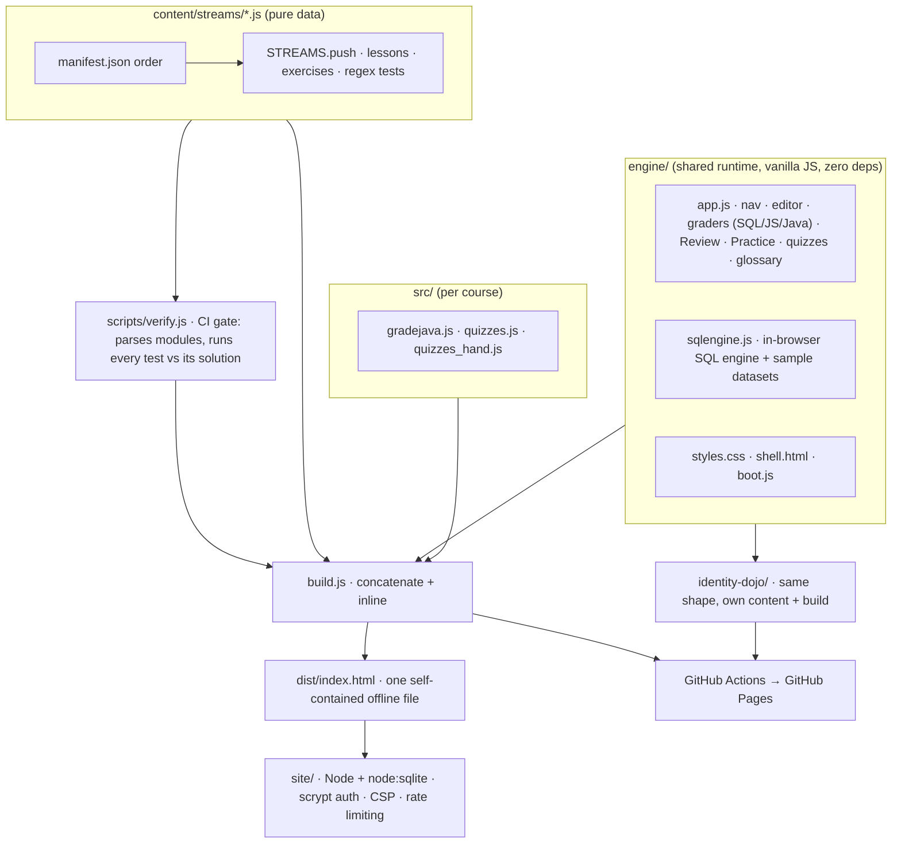

<p align="center">
  
</p>

<p align="center">
  <a href="https://rcbart.github.io/knowledge-base/dev/"></a>
  <a href="https://rcbart.github.io/knowledge-base/identity/"></a>
  
  
  
  
  
</p>

# DevDojo 🥋

An interactive, self-contained learning platform for software engineering. **28 training tracks,
200 lessons, and 313 hands-on exercises** run entirely in the browser — an in-editor coding
exercise on every lesson, a belt progression, **spaced-repetition review**, a **difficulty-filtered practice hub**, a domain
glossary with click-to-explain terms, tournaments, and end-to-end capstone projects.

It began as a Java course (JavaDojo) and now spans the full stack: the Java language and JVM,
computer science & algorithms, web/HTTP, front-end (React), APIs, databases & SQL, concurrency,
security & cryptography, DevOps, architecture, and a senior ("dan") track. Identity & access has its
own course (below).

**Identity & access now lives in its own course.** It grew to 132 lessons — 40% of DevDojo — which
unbalanced a course meant to cover software engineering broadly. It is now
[**IdentityDojo**](identity-dojo/README.md): 14 streams covering the identity lifecycle, OAuth 2.0/2.1
and OIDC, SAML, WebAuthn/FIDO2 internals, Active Directory and Kerberos, zero trust, and a Running
Identity stream on incident response, migration and operations. Same engine, separate build.

**▶ Live:** https://rcbart.github.io/knowledge-base/ — a landing page for both courses.
[**DevDojo**](https://rcbart.github.io/knowledge-base/dev/) ·
[**IdentityDojo**](https://rcbart.github.io/knowledge-base/identity/). Each is a single,
self-contained page; SQL exercises run against real sample data in your browser with no server.
*(First time: in Settings → Pages, set Source to "GitHub Actions"; the workflow verifies and builds
both courses on every push and fails the deploy if either content check fails.)*

## What's inside

- **Guided onboarding** — a **🚀 Getting started** page (how to set up your environment and how
  grading really works) and a **🗺️ Learning path** (a recommended white→black-belt route).
- **Every lesson** ends with an exercise in the built-in editor. **How grading works:** most exercises (~79%, all the Java ones) are checked by **regex against the shape of your answer** —
  they verify you wrote the right construct, not that your code runs correctly. Real execution is
  available where the environment allows it: **SQL** runs against sample datasets in the built-in
  engine and **JavaScript** in a sandboxed Web Worker (~4% of exercises, graded on actual results),
  and **Java** compiles and runs for real only if you start the optional local runner. Every exercise
  ships a **Run locally** panel with exact commands, which is the ground truth.
- **Run it for real** — every exercise has a **🖥️ Run locally** panel with exact commands for your own
  dev environment, plus a **🔬 Dive deeper** panel that states honestly how it was graded.
- **🔁 Review** — spaced repetition builds a review deck from your completed exercises and schedules
  them on expanding intervals; the sidebar shows what's due.
- **🎯 Practice** — every exercise is rated easy/medium/hard and filterable, giving a difficulty ramp
  across the whole catalog.
- **🧠 Quick check** — multiple-choice questions with instant feedback: not just "wrong", but which
  answer was right, why it is right, and why the option you picked is not. **Options are shuffled per
  lesson visit**, so the answer position can never be memorised. DevDojo now carries **140 hand-authored
  questions across 47 lessons** — each with a written explanation of why the right answer is right and
  why every distractor is wrong — plus 41 auto-generated from the exercise specs. IdentityDojo carries a
  further 297. Extending the hand-authored bank to the remaining lessons is an open item.
- **📖 Glossary** — 10 domains / 272 terms, collapsible and searchable, doubling as the in-lesson
  click-to-explain source.
- **Belts & capstones** — per-domain percentage belts (white → black), dan sub-tracks for advanced
  topics, and a graded multi-step capstone. Streams
  flagged `tournament:true` or `project:true` are practice and don't count toward belts.

## Architecture

Three decoupled layers — content is pure data, a vanilla-JS runtime renders it, and a build step
fuses everything into one offline file. An optional Node/SQLite backend adds accounts and progress.



**How grading works (honestly).** The headline number to be careful with is the **content checks**
badge: `scripts/verify.js` runs 1566 assertions proving every exercise's reference solution matches its
own regex checks and that ids are unique. That is a **content integrity gate, not a test suite for a
running product** — it says the material is internally consistent, not that a learner's code is
correct.

Grading itself splits three ways:

| Path | Share | What it actually verifies |
|---|--:|---|
| Regex structural checks | ~79% | That your answer contains the expected constructs. Not correctness. |
| Real execution, in-browser | ~4% | SQL against sample data (`engine/sqlengine.js`, result sets compared); JavaScript in a sandboxed Web Worker (real return values). |
| Real execution, opt-in | Java | Compiles and runs via the local runner (`site/` + `JD_LOCAL_RUNNER=1`) with a generated `DojoTest` harness — **off by default**. |

So a green check on most exercises means "this looks right", not "this works". Every exercise has a
**Run locally** panel with exact commands, and that is the ground truth. Raising the share of real
execution is the most valuable open improvement to the platform.

## Screenshots


*The home page: belt progression per domain, and the "how to learn & retain" guide.*


*A SQL lesson — the in-editor exercise, "What your code must do", and the Compile & Run panel. SQL is
graded by running it against sample data and comparing result sets.*


*The domain-grouped glossary. Every term here is also click-to-explain inside any lesson.*

## Repository layout

```
engine/             the SHARED RUNTIME — used by every course in this repo
  app.js            state, nav, editor, graders, Review (SRS), Practice, quizzes, glossary
  sqlengine.js      dependency-free in-browser SQL engine + sample datasets
  boot.js           startup wiring
  shell.html        page shell (placeholders: @@STYLES@@, @@SCRIPT@@)
  styles.css        all styling
src/                DevDojo's own content-derived maps (NOT the engine)
  gradejava.js      auto-generated executable-grading specs (by lesson id)
  quizzes.js        auto-generated quick-check bank (by lesson id)
  quizzes_hand.js   hand-authored quizzes, where they exist
content/streams/    one module per stream — the course content
  manifest.json     stream order
scripts/verify.js   content integrity gate: parses every module, runs each exercise's
                    regex tests against its own solution, checks id uniqueness
build.js            engine/ + src/ + content/ -> dist/index.html (+ devdojo.html)
identity-dojo/      IdentityDojo: same shape, consumes ../engine
site/               optional Node server: accounts, progress sync (SQLite via node:sqlite)
```

**Why `engine/` is separate.** `src/` used to be both "DevDojo's source" and "the shared runtime",
which meant a second course could only be added by forking 1,600 lines of `app.js`. Splitting the
engine out makes the seam explicit: a course is content plus a build file, and lifting one into its own
repository is a copy rather than a fork.

Identity content lives in **[`identity-dojo/`](identity-dojo/README.md)** with its own manifest and
build. It reuses this runtime (`identity-dojo/build.js` reads `../src`), so there is one engine to
maintain; only content, domain grouping and the page shell differ.

## Workflow

```bash
node scripts/verify.js   # validate all content (target: 0 failures)
node build.js            # produce dist/index.html (+ devdojo.html copy)
```

The build output is a single, dependency-free HTML file — open `devdojo.html` directly in a browser,
or host `dist/index.html` on any static host. Generated files are gitignored; only source is
versioned.

### Optional: run the full site (accounts + saved progress)

```bash
PORT=3000 node site/server.js     # then open http://localhost:3000
```

Requires Node 22.5+ (built-in SQLite). Behind HTTPS, set `JD_SECURE_COOKIES=1`; behind a trusted
reverse proxy, set `JD_TRUST_PROXY=1`. The user database lives in `site/data/` and is gitignored.

## Editing content

Each stream module calls `STREAMS.push({ icon, title, blurb, lessons:[...] })`. A lesson has `body`
(HTML), optional `docs` links, and one `ex` or several `exs`. An exercise carries `prompt`,
`starter`, `solution`, regex `tests` (`{ d, re, flags?, not? }`), `behavior` (shown as "What your
code must do"), and `hints`. Non-Java exercises set `lang` (`'sql'`, `'shell'`, `'js'`, `'jsx'`,
`'text'`). Identity modules add `iam:true` and a `sec:'...'` sub-category label.

Content lives inside JS template literals. Escaping rules that keep the build clean: escape backticks
and `${`; in HTML `body` code samples use `&lt;`/`&gt;`/`&amp;`; keep single-quoted `hints` free of
apostrophes and `\u` sequences. Always run `node scripts/verify.js` after editing.

## Companion courses (standalone, in this repo)

Separate hands-on courses, each a self-contained interactive site:

- `docker-crash-course/`, `kubernetes-crash-course/`, `istio-crash-course/`, `envoy-crash-course/`
- `ml-dojo` — a machine-learning curriculum (Python via Pyodide). It forked the engine and shares
  nothing with this repo, so it now lives in its own repository: https://github.com/rcbart/ml-dojo
- `oauth-trainer/` — a small Maven CLI for generating and signing JWKs

## Companion docs

- `DEVDOJO_ROADMAP.md` — per-domain belt design and curriculum plan
- `IAM_TOPICS.md` — the identity & access topic map
- `LAUNCH_GUIDE.md` — hosting → backend → AI judge → sandboxed runner
- `BACKEND_PLAN.md` — architecture for publishing DevDojo as a product
- `MLDOJO_PLAN.md` — ml-dojo architecture and curriculum
