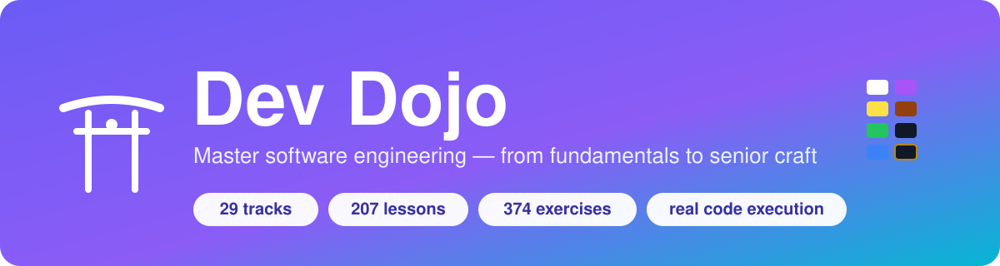
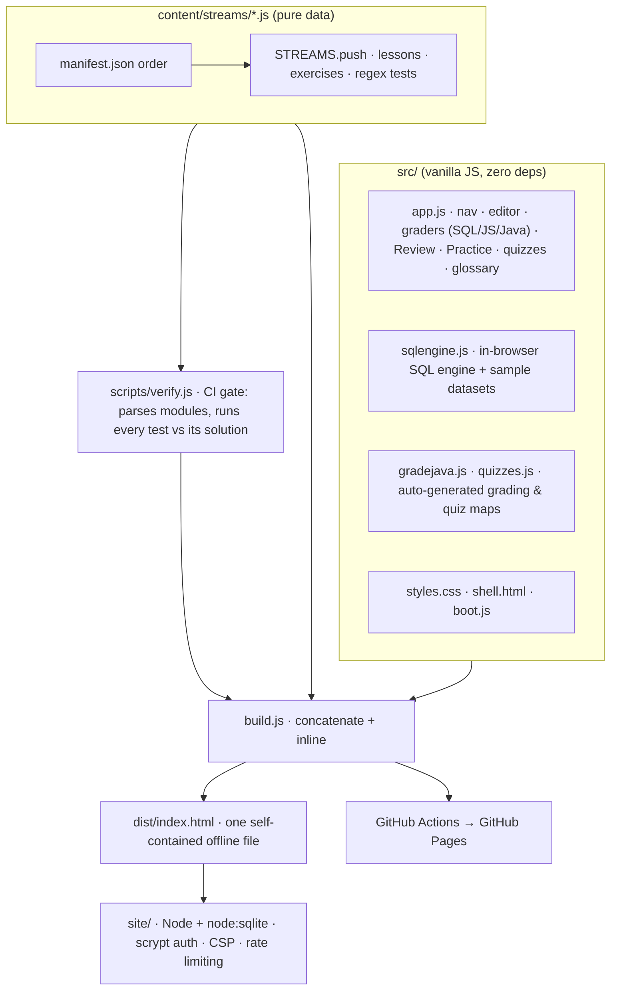
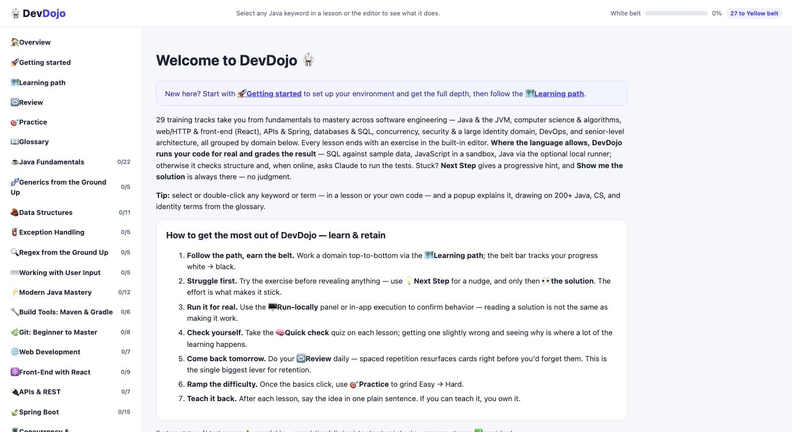
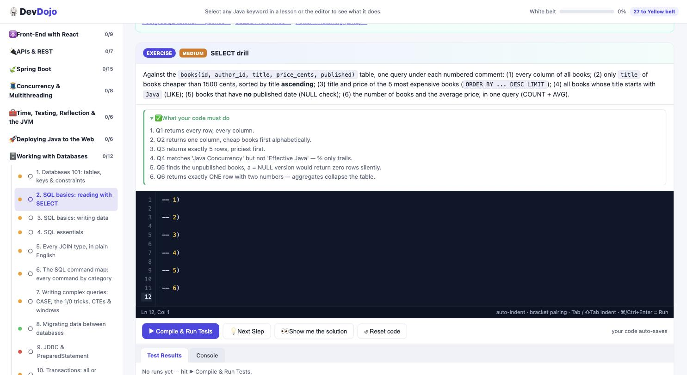
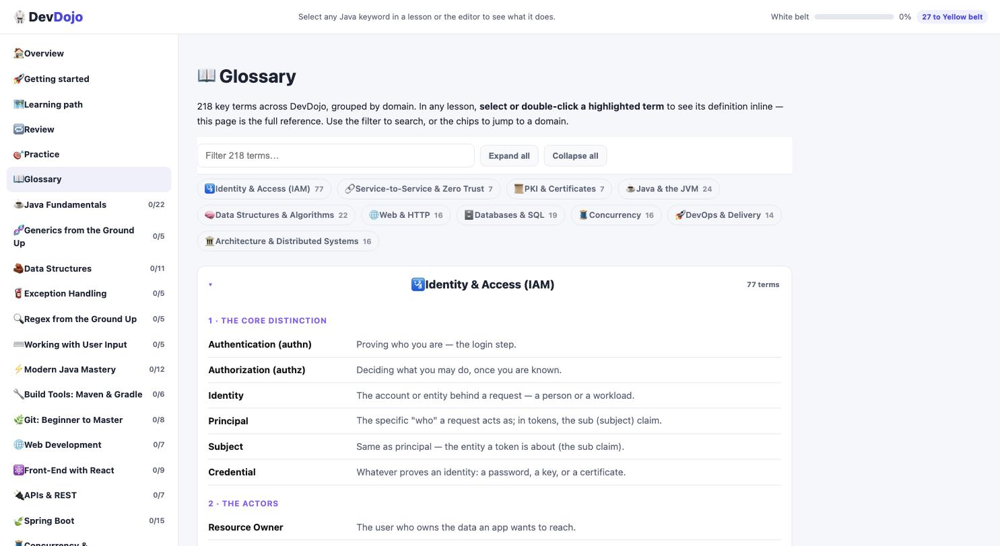

<p align="center">
  
</p>

<p align="center">
  <a href="https://rcbart.github.io/knowledge-base/"></a>
  
  
  
  
  
</p>

# DevDojo 🥋

An interactive, self-contained learning platform for software engineering. **29 training tracks,
315 lessons, and 435 hands-on exercises** run entirely in the browser — an in-editor coding
exercise on every lesson, **real code execution where possible** (SQL, JavaScript, and opt-in Java),
a belt progression, **spaced-repetition review**, a **difficulty-filtered practice hub**, a domain
glossary with click-to-explain terms, tournaments, and end-to-end capstone projects.

It began as a Java course (JavaDojo) and now spans the full stack: the Java language and JVM,
computer science & algorithms, web/HTTP, front-end (React), APIs, databases & SQL, concurrency,
security & cryptography, a large identity & access domain, DevOps, architecture, and a senior
("dan") track.

**Identity & access is the deepest domain** — 115 lessons across 13 sub-categories, built to teach the
concepts *before* the protocols that assume them: what a token actually is and how a role differs from
a format, the identity lifecycle from proofing to deprovisioning, and why SSO is a user experience
while federation and delegation are the mechanisms underneath. From there into OAuth 2.0/2.1 and PKCE
end to end, OIDC, SAML, WebAuthn/FIDO2 internals, DPoP and sender-constrained tokens, SD-JWT selective
disclosure, zero trust, data-level authorization and IDOR, on-behalf-of chains, and the patterns most
courses skip entirely — API keys, capability URLs, cross-account role assumption, and support
"act as user" access.

**▶ Live demo:** https://rcbart.github.io/knowledge-base/ — a single, self-contained page. SQL
exercises run against real sample data in your browser (built-in engine, no server). *(First time:
in the repo's Settings → Pages, set Source to "GitHub Actions"; the included workflow builds and
deploys on every push.)*

## What's inside

- **Guided onboarding** — a **🚀 Getting started** page (how to set up your environment and how
  grading really works) and a **🗺️ Learning path** (a recommended white→black-belt route).
- **Every lesson** ends with an exercise in the built-in editor, graded by **real execution where the
  language allows**: SQL runs against sample datasets in a built-in engine, JavaScript runs in a
  sandboxed Web Worker, and Java compiles+runs via an opt-in local runner (with an auto-generated
  test harness). Everything else uses fast structural + AI-assisted checks with a Run-locally fallback.
- **Run it for real** — every exercise has a **🖥️ Run locally** panel with exact commands for your own
  dev environment, plus a **🔬 Dive deeper** panel that states honestly how it was graded.
- **🔁 Review** — spaced repetition builds a review deck from your completed exercises and schedules
  them on expanding intervals; the sidebar shows what's due.
- **🎯 Practice** — every exercise is rated easy/medium/hard and filterable, giving a difficulty ramp
  across the whole catalog.
- **🧠 Quick check** — 250 multiple-choice questions with instant feedback: not just "wrong", but which
  answer was right, why it is right, and why the option you picked is not. The concept-heavy lessons
  carry hand-authored questions in plain English; the rest are auto-generated from the exercise specs.
  **Options are shuffled per lesson visit**, so the answer position can never be memorised.
- **📖 Glossary** — 10 domains / 259 terms, collapsible and searchable, doubling as the in-lesson
  click-to-explain source.
- **Belts & capstones** — per-domain percentage belts (white → black), dan sub-tracks for advanced
  topics, and a graded multi-step capstone (e.g. the Identity "build a secure auth service"). Streams
  flagged `tournament:true` or `project:true` are practice and don't count toward belts.

## Architecture

Three decoupled layers — content is pure data, a vanilla-JS runtime renders it, and a build step
fuses everything into one offline file. An optional Node/SQLite backend adds accounts and progress.



**How grading works (honestly):** grading uses real execution where the language allows and falls
back to structural + AI checks otherwise. **SQL** runs in a dependency-free in-browser engine
(`src/sqlengine.js`) and is graded by comparing your result set to the reference solution's.
**JavaScript** runs in a sandboxed Web Worker and is graded on real return values. **Java** compiles
and runs via an opt-in local runner (`site/` + `JD_LOCAL_RUNNER=1`) using an auto-generated
`DojoTest` harness. For the rest, regex + an in-app AI runner check structure, and every exercise has
a **Run-locally** panel for ground truth. `scripts/verify.js` additionally guarantees every solution
passes its own tests and every blank starter fails at least one.

## Screenshots


*The home page: belt progression per domain, and the "how to learn & retain" guide.*


*A SQL lesson — the in-editor exercise, "What your code must do", and the Compile & Run panel. SQL is
graded by running it against sample data and comparing result sets.*


*The domain-grouped glossary. Every term here is also click-to-explain inside any lesson.*

## Repository layout

```
src/
  shell.html        HTML page shell (placeholders: @@STYLES@@, @@SCRIPT@@)
  styles.css        all styling
  app.js            runtime: state, nav, editor, graders, Review (SRS), Practice, quizzes, glossary
  sqlengine.js      dependency-free in-browser SQL engine + sample datasets
  gradejava.js      auto-generated executable-grading specs (attached by lesson id)
  quizzes.js        auto-generated quick-check quiz bank (attached by lesson id)
  quizzes_hand.js   hand-authored plain-English quizzes; take priority over the generated bank
  boot.js           startup calls (identity merge, gradeJava/quiz attach)
content/streams/    one module per stream (the course content — most edits happen here)
  manifest.json     stream order (also the sub-category order for the merged Identity stream)
  _header.js        defines the STREAMS array
  _footer.js        build marker
scripts/
  verify.js         content test suite: parses every module, runs each exercise's regex tests
                    against its own solution, checks id uniqueness
build.js            assembles src/ + content/ into dist/index.html and a devdojo.html copy
site/               optional Node server: accounts, progress sync, admin (SQLite via node:sqlite)
```

The 13 identity modules (`16b`–`16m` plus the `16z` capstone) are merged at runtime into a single
**Identity and Access** stream with named sub-categories, so the app shows 29 tracks from 41 content
files. Those sub-categories, in reading order:

| Sub-category | Lessons | Sub-category | Lessons |
|---|--:|---|--:|
| Identity & federation foundations | 23 | SAML & enterprise web SSO | 5 |
| Authentication & MFA | 13 | PKI & certificates | 6 |
| Authorization models | 8 | Service-to-service & zero trust | 8 |
| Sessions, cookies & web login | 6 | Enterprise identity & directories | 8 |
| OAuth 2.0 & OpenID Connect | 15 | Advanced OAuth & threats | 8 |
| Tokens: JWT & JOSE | 7 | Governance & privileged access | 7 |
| | | Capstone project | 1 |

## Workflow

```bash
node scripts/verify.js   # validate all content (target: 0 failures)
node build.js            # produce dist/index.html (+ devdojo.html copy)
```

The build output is a single, dependency-free HTML file — open `devdojo.html` directly in a browser,
or host `dist/index.html` on any static host. Generated files are gitignored; only source is
versioned.

### Optional: run the full site (accounts + saved progress)

```bash
PORT=3000 node site/server.js     # then open http://localhost:3000
```

Requires Node 22.5+ (built-in SQLite). Behind HTTPS, set `JD_SECURE_COOKIES=1`; behind a trusted
reverse proxy, set `JD_TRUST_PROXY=1`. The user database lives in `site/data/` and is gitignored.

## Editing content

Each stream module calls `STREAMS.push({ icon, title, blurb, lessons:[...] })`. A lesson has `body`
(HTML), optional `docs` links, and one `ex` or several `exs`. An exercise carries `prompt`,
`starter`, `solution`, regex `tests` (`{ d, re, flags?, not? }`), `behavior` (shown as "What your
code must do"), and `hints`. Non-Java exercises set `lang` (`'sql'`, `'shell'`, `'js'`, `'jsx'`,
`'text'`). Identity modules add `iam:true` and a `sec:'...'` sub-category label.

Content lives inside JS template literals. Escaping rules that keep the build clean: escape backticks
and `${`; in HTML `body` code samples use `&lt;`/`&gt;`/`&amp;`; keep single-quoted `hints` free of
apostrophes and `\u` sequences. Always run `node scripts/verify.js` after editing.

## Companion courses (standalone, in this repo)

Separate hands-on courses, each a self-contained interactive site:

- `docker-crash-course/`, `kubernetes-crash-course/`, `istio-crash-course/`, `envoy-crash-course/`
- `ml-dojo/` — a fork of the engine for a machine-learning curriculum (Python via Pyodide)
- `oauth-trainer/` — a small Maven CLI for generating and signing JWKs

## Companion docs

- `DEVDOJO_ROADMAP.md` — per-domain belt design and curriculum plan
- `IAM_TOPICS.md` — the identity & access topic map
- `LAUNCH_GUIDE.md` — hosting → backend → AI judge → sandboxed runner
- `BACKEND_PLAN.md` — architecture for publishing DevDojo as a product
- `MLDOJO_PLAN.md` — ml-dojo architecture and curriculum
